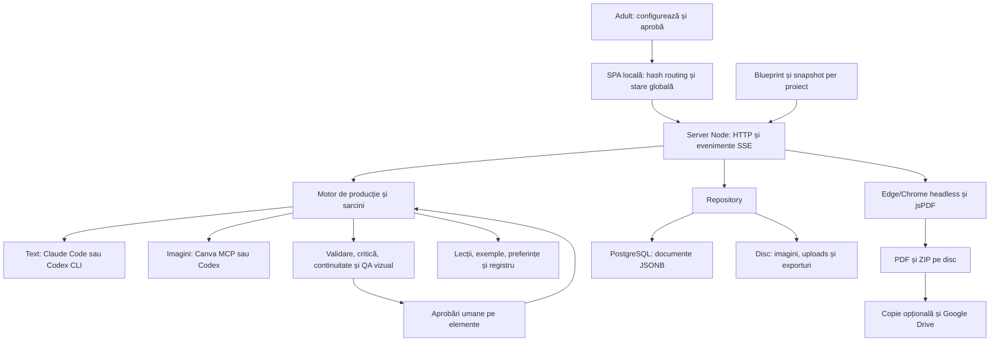

# WonderPages.AI — raport de analiză inițială
Data: 1 octombrie 2026. Secțiunile 1–9 păstrează analiza inițială ca baseline istoric. **Starea curentă v03 este în secțiunea 10 și FINAL REGRESSION TEST**; constatările inițiale nu reprezintă automat probleme rămase.

**Constrângeri confirmate ulterior de utilizator:** producție în limita ChatGPT Plus, Claude Pro și Canva Pro; șase volume per colecție; carte de poveste și carte de colorat pentru fiecare volum; categoriile de vârstă păstrate. Contractul de revizuire pe elemente și direcția premium sunt detaliate în [DECIZII-PRODUS.md](D:/work.use/startup.project.wonderpages/app.workspace/ANALIZA-INITIALA/DECIZII-PRODUS.md). Sunt cerințe și propuneri, nu funcționalități deja implementate.

## 1. Rezumat executiv

WonderPages este un **atelier editorial local pentru un adult care produce colecții de povești ilustrate și cărți de colorat**, cu intervenție umană la aprobări. Nu este încă o platformă de lectură pentru copii sau un serviciu web cu conturi de familie. Motorul conduce producția dintr-un blueprint: formular, profil de vârstă, personaje, scenarii, verificări, imagini, adaptare lingvistică și export.

Baza este utilă și merită păstrată: identități vizuale canonice, distribuție pe volume, pagini cu acțiuni explicite, critică separată de scriere, continuitate, referințe pentru imagini și aprobări pe elemente. **Nu există însă dovada unei cărți complete produse, aprobate și livrate corect de această instalare.** Testele actuale sunt 55/56; testul PDF eșuează. Mai grav pentru încrederea editorială, unele verificări pot declara succes când lipsesc elemente sau evaluări.

Prioritatea este să facem adevărate afirmațiile „aprobat”, „verificat” și „livrat”. Abia apoi are sens extinderea sistemului narativ și optimizarea volumului de producție.

### Ce am analizat și cum

Am respectat ordinea cerută: **audit integral → ghid integral → aplicație, sursă, ZIP și interfață reală**.

| Material | Acoperire și constatare |
|---|---|
| AUDIT-V02 | Toate cele 23 de fișiere: rapoarte, hărți, matrice, CSV-uri, capturi de accesibilitate, rezultate și scripturi de probe. Inclusiv limitele auditului, nu doar concluziile. |
| Ghid_Complet_WonderPages_AI.pdf | Toate cele 26 de pagini, inclusiv anexele A/B/C. PDF-ul nu conține imagini; toate paginile au text extras. |
| Proiect instalat | Inventar, instalare, configurări publice, entry points, interfață, motor, validări, furnizori text/imagine, stocare, aprobări, export, agenți și învățare; inspecție orientată pe traseele relevante. Nu pretind o revizuire exhaustivă a fiecărei linie din toate fișierele. |
| ZIP neinstalat | Inventar și comparație SHA-256 cu sursa instalată: **112/112 fișiere identice**, zero fișiere lipsă sau diferite; fără extragere sau reinstalare. |
| Web real | localhost:4321: panou, progres, revizuire, carte, livrare, formular nou, tipuri de produs, agenți, învățare, setări și îmbunătățiri. Verificări la 375, 768 și 1440 px, capturi vizuale, arbore de accesibilitate, formular gol și tastatură. |
| Date reale | Dinosaur World: proiect pregătit, blueprint capturat v13, șase artefacte importate, scenariul volumului 1, referințe Milo/Tia; zero decizii și aprobări. |
| Verificare executabilă | Suita existentă în mediu temporar cu furnizori simulați; cinci probe independente ale contractelor, fără apel AI real. |

Codul aplicației, configurațiile și proiectul real nu au fost modificate. Fișierele noi sunt exclusiv raportul și dovezile din ANALIZA-INITIALA. Comparația finală confirmă din nou 112/112 fișiere sursă identice cu ZIP-ul.

**Statutul documentelor:** recomandările, comenzile și regulile din audit/ghid sunt informații despre sistem și despre verificările anterioare, nu autorizații noi de instalare, ștergere, generare sau publicare. Cererea ta stabilește obiectivul și ordinea. Ghidul citează auditul drept sursă; acordul lor nu este o confirmare independentă.

**Limitele verificării:** nu am generat o colecție cu Claude/Canva/Codex reale, nu am restaurat baza reală și nu am publicat sau trimis fișiere în Drive. Rezultatele cu simulări dovedesc comportamente tehnice, nu calitatea literară sau stabilitatea furnizorilor reali. Nu există baseline vizual pentru un verdict de regresie. Nu este o certificare WCAG, un test de penetrare sau o validare pedagogică prin studii cu copii. Aplic principiile editoriale descrise în cererea ta; nu pretind că am parcurs integral cele opt cărți publicate pe care le-ai enumerat.

## 2. Arhitectura

### Harta sistemului

### Componente și responsabilități

| Zonă | Implementare | Implicație |
|---|---|---|
| Pornire | server/start.js, apoi server/index.js; instalator Windows și pornire în fundal | Aplicație locală, dependentă de mediul laptopului. |
| Frontend | public/index.html și core/views/ui/actions/pdf.js, JavaScript clasic, stare comună S | Fără React sau bundler. Rutare prin hash; componentele comunică prin aceeași stare globală. |
| Backend | Router HTTP propriu, aproximativ 105 rute în inventarul auditului | Validarea și politica de autorizare trebuie urmărite pe fiecare familie de rute. |
| Producție | server/engine.js, blueprint kids-sc v14 | 22 definiții de etape se extind în 97 de pași pentru șase volume; unele sunt condiționale. |
| Date | Repo și PostgreSQL, șapte tabele, în principal JSONB | Persistență reală; fișierele mari rămân pe disc. Schema nu are relații FK între proiecte și artefacte. |
| Text | Claude Code Sonnet/Haiku; opțional GPT-6-Sol prin Codex CLI | Alegerea modelului este per agent. Autentificarea și disponibilitatea unui model sunt verificări diferite. |
| Imagini | Canva MCP sau Codex pentru imagini; alternare doar dacă este configurată | Identitatea este transmisă prin descrieri, referințe și contracte de pagină, nu garantată prin antrenare dedicată. |
| Export | Canvas → JPEG → jsPDF; browser headless pornit de server | Textul devine imagine; succesul depinde de browser, font, memorie și încărcarea fișierelor. |
| Învățare | Lecții persistente, exemple TF-IDF, regresie logistică locală, variante Thompson | Nu modifică greutățile modelului Claude/GPT. Învață preferințe și reguli din jurul modelului. |
| Asistență și mentenanță | Dali, lista de îmbunătățiri, inginer în copie de lucru | Există interfață și cod; execuția completă reală nu a fost verificată în acest audit. |

### Fluxul editorial actual

Tema, vârsta, limbile, stilul, formatul și materialele părintelui/editorului intră în formular. Urmează descrierea referințelor, brief, arc de colecție, bible, distribuție și fișe vizuale. Prima aprobare privește conceptul colecției.

Pentru fiecare volum: scenariu → critică și revizie → continuitate → imagini demonstrative → aprobare demo → text final → continuitate finală → adaptare și verificare lingvistică → ilustrații → QA vizual → colorat → preflight → aprobare finală. Livrarea pe volum permite continuarea colecției fără a aștepta toate volumele. Motorul poate pregăti textul următor în paralel cu desenarea imaginilor; există semnătură de invalidare pentru prefetch.

Artefactele au versiuni și proveniență. Imaginile au o referință basedOn către sursa textuală. Proiectul păstrează propriul snapshot de blueprint: **Dinosaur World v13 și tipul publicat v14 pot coexista legitim**. Nu recomand migrarea automată a proiectului existent.

### ZIP, instalare și runtime

Pachetul este o aplicație Node, nu un proiect care necesită compilare frontend. package.json folosește npm și package-lock.json; comanda de pornire este npm start, iar verificarea existentă este npm test. Nu există script build. Verificarea corectă este instalare reproductibilă, pornire, teste și fluxuri reale, nu inventarea unui build.

Declarația minimă este Node >=20; intervalul consemnat de testare este >=20 și <25. Dependențele includ pg 8.23.0, jsPDF 2.5.1, MCP SDK 1.30.1 și Codex 0.159.0. Instalarea presupune Windows, Docker/PostgreSQL, Claude Code autentificat, Canva conectat și Edge/Chrome pentru livrare. Fontul Andika este local.

În instalarea observată: PostgreSQL răspunde; Claude Code este 2.1.268, dar autentificarea Claude nu a fost încă verificată; Canva este raportat conectat; componenta Codex pentru imagini raportează 0.143.0 și autentificare disponibilă. **Textul Codex folosește pachetul inclus 0.159.0, în timp ce statusul imaginilor verifică executabilul global.** Un indicator comun „Codex text și imagini” poate ascunde această diferență.

Nu am citit sau copiat valorile din .env. .env.example și instalatorul descriu configurarea, dar nu dovedesc că serviciile externe funcționează complet.

## 3. Funcționalități: ce există, ce funcționează și ce trebuie păstrat

Distincția folosită: „observat” = interfață/date reale; „testat” = verificare automată cu simulări; „implementat” = traseu în sursă, cu execuția reală încă neconfirmată.

| Funcție | Statut verificat | Observație |
|---|---|---|
| Panou, proiecte și navigare | Observat | Serverul și interfața se încarcă; proiectul importat este accesibil. |
| Formular cu vârstă, limbi, stil, format și referințe | Observat; validare minimă testată în browser | „Continuă” pe formular gol indică tema și vârsta obligatorii; nu creează proiect. |
| Blueprint publicat și snapshot per proiect | Observat și testat | v14 pentru proiecte noi, v13 în Dinosaur World. |
| Brief, arc de serie, bible și cast | Observat în datele importate | Documentele există; importul nu dovedește generarea lor cu AI în această instalare. |
| Versionare, comentarii și editare manuală | Implementat/testat | Util pentru control editorial; invalidarea aprobărilor este insuficientă. |
| Scenariu, critică separată și revizie țintită | Implementat/testat | Se păstrează, dar validarea evaluării trebuie întărită. |
| Continuitate între pagini și volume | Implementat/testat | Registru și verificări; nu echivalează cu o carte finală verificată vizual. |
| Identitate vizuală și referințe | Observat/implementat | Milo și Tia au imagini încărcate, descrieri canonice și anatomie explicită. |
| Preview poveste/colorat și storyboard | Observat | Volumul 1 afișează scenariul și placeholders; nu există ilustrații de pagină. |
| Adaptare în română | Implementat/testat | Nu există încă traducere reală în proiectul inspectat. |
| Aprobări pe document/text/imagine | Implementat/testat | Control util, dar lipsurile și versiunile schimbate nu sunt tratate complet. |
| Generare și QA imagini | Implementat, teste cu simulări | Nu a fost verificat un volum complet cu furnizori reali. |
| Livrare PDF | Eșec reprodus | Testul actual de livrare headless eșuează. |
| Pachet ZIP și copii locale | Implementat/testat parțial | Pachetul poate avea succes fără conținut complet. |
| Backups/import/export proiect | Implementat/testat izolat | Restaurarea și integritatea unui backup real nu au fost demonstrate. |
| Agenți, lecții și exemple | Observat/implementat | 11 roluri, 24 de reguli active; zero exemple aprobate și zero volume evaluate. |
| Dali și îmbunătățiri | Interfață observată, cod existent | Nu am pornit conversații sau execuții reale. |
| Acces LAN | Configurat în runtime | Autentificare prin cod și sesiuni, transport HTTP necriptat. |

### Elemente de păstrat

Păstrăm motorul bazat pe blueprint și snapshoturile proiectelor, Repo/stocarea existentă, versionarea, comentariile, distribuția personajelor și continuitatea, descrierile canonice cu anatomie/invariante, critică separată, revizia pe pagini, adaptarea naturală în română, coloratul derivat din aceeași scenă, aprobările umane, fonturile locale și lecțiile cu domeniu controlat.

Nu este justificată o rescriere totală în alt framework. Modificările trebuie să întărească aceste contracte și să reducă duplicarea dintre browser și server.

## 4. Probleme și severități

„Reprodus” în probele noi înseamnă o verificare a funcțiilor motorului cu date sintetice, nu aprobări făcute pe proiectul real. Auditul precedent rămâne o sursă istorică separată.

### CRITICAL

Nu am demonstrat un defect CRITICAL de securitate sau o pierdere de date în instalarea reală. **Există blocaje HIGH care împiedică declararea produsului pregătit pentru livrare**, în special PDF-ul și contractul de aprobare. Nu reduc severitatea lor doar pentru că majoritatea testelor trec.

### HIGH — înainte de producție

| ID | Problemă, cauză și dovadă | Soluție recomandată |
|---|---|---|
| H01 | **PDF headless eșuează.** 55/56 teste; livrarea se oprește cu „Browserul de livrare s-a închis neașteptat.” Reproduce B01 din audit. renderer.js ignoră stdout/stderr, astfel cauza exactă rămâne necunoscută. | Colectare diagnostică limitată, evenimente de pornire/exit și timeout; reproducere cu browserul detectat; verificare fișier rezultat. Nu presupune că jsPDF este cauza și nu aplica arbitrar --no-sandbox pe Windows. |
| H02 | **Pachetul „final” al colecției poate avea succes fără aprobări sau conținut complet.** API verifică aprobarea doar când volume este specificat; buildPackage sare peste volume fără final/aprobare, apoi creează ZIP și packagedAt. Confirmare prin sursă și UI; probele HTTP istorice au produs un ZIP cu un fișier și zero decizii. | Contract unic pentru livrare pe volum și colecție; manifest obligatoriu, zero fișiere lipsă; separare explicită preview/final. Nu marca final un pachet parțial. |
| H03 | **O aprobare închisă rămâne valabilă după schimbarea textului.** volumeApproved verifică numai statusul etapei și imported. Editarea artefactului nu redeschide gate-ul. Proba arată item pending după schimbare, dar deliveryAllowedAfterChange=true. | Aprobarea trebuie legată de versiunea/hashul conținutului, referințelor și blueprintului relevant; invalidare propagată și reverificare la export/Drive/Canva. |
| H04 | **Elementele lipsă dispar din aprobarea finală.** gateItems enumeră ce există, nu ce este obligatoriu. Pentru un volum bilingv cu imagini active sunt așteptate 50 elemente: 12 texte originale + 12 adaptate + 13 color + 13 lineart. Cu numai 12 texte originale, proba emite 12 itemi și done=true după aprobarea lor. | Enumerarea elementelor așteptate; stări missing/error distincte; gate incomplet dacă lipsește orice element obligatoriu. Politică separată și explicită pentru proiectele fără imagini. |
| H05 | **Criticul poate trece cu rubrică incompletă.** Un singur criteriu UNKNOWN=10 produce pass=true; T01/T07/T08 lipsă nu sunt eșecuri. Declararea unei scheme CLI nu înlocuiește validarea locală și acoperirea semantică. | Exact un rezultat pentru fiecare cod cerut în etapa respectivă, fără coduri necunoscute sau duplicate; criterii critice obligatorii; răspuns invalid → corecție limitată sau oprire, nu scor de succes. |
| H06 | **QA vizual poate raporta succes fără verdict complet sau după o redesenare încă nereușită.** qaPages are fallback {ok:true} când lipsește rezultatul; cele patru dimensiuni sunt opționale în procesare. Proba preflight pentru ok=false, redrawn=true returnează pass. | Schematizare și mapare strictă după imagine/pagină; lipsa verdictului este unknown/fail; succes numai după verdictul curent complet. Redesenat și verificat sunt stări diferite. |
| H07 | **Presetul „Tipar” nu reprezintă un profil de publicare validat.** Cărțile actuale separate au 12 pagini + două coperți. Bleed este 3 mm pe toate laturile; textul și lineart sunt rasterizate JPEG; nu se verifică DPI efectiv al surselor. | Profil separat pentru destinația reală: interior și copertă, trim/bleed/gutter, număr de pagini, rezoluție și verificare PDF. Nu eticheta automat fișierul „gata de publicare”. |
| H08 | **Disponibilitatea textului GPT-6-Sol nu este demonstrată pentru calea CLI a aplicației.** Auditul păstrează un eșec real anterior; UI afirmă autentificare folosind statusul Codex pentru imagini. Textul folosește alt executabil/versionare. | Capabilități și status separate pentru text/imagine, probe mici pe furnizorul efectiv, tratarea explicită a modelului indisponibil. Eșecul istoric nu dovedește că modelul este încă indisponibil astăzi. |

Dovezi de cod: [volumeApproved](D:/work.use/startup.project.wonderpages/app.workspace/app.wonderpages.ai/server/engine.js:868), [gateItems](D:/work.use/startup.project.wonderpages/app.workspace/app.wonderpages.ai/server/engine.js:1043), [evaluateCritique](D:/work.use/startup.project.wonderpages/app.workspace/app.wonderpages.ai/server/engine.js:458), [QA vizual](D:/work.use/startup.project.wonderpages/app.workspace/app.wonderpages.ai/server/engine.js:337), [pachet](D:/work.use/startup.project.wonderpages/app.workspace/app.wonderpages.ai/server/index.js:209), [PDF](D:/work.use/startup.project.wonderpages/app.workspace/app.wonderpages.ai/public/app/pdf.js:145).

Pentru KDP, un interior de 12/14 pagini este sub minimul de 24 pentru opțiunile uzuale alb-negru/premium color; standard color cere minimum 72. Schema actuală cu coperțile incluse în același PDF nu este un interior KDP separat. Aceasta este concluzie de compatibilitate din cod, nu o respingere efectivă la upload. [KDP Print Options](https://kdp.amazon.com/en_US/help/topic/G201834180).

KDP cere minimum 300 DPI pentru imagini și, pentru interior cu bleed, lățimea trim + 0,125 in și înălțimea trim + 0,25 in. În consecință, canvas de 300 DPI nu certifică rezoluția ilustrației sursă, iar bleed simetric de 3 mm nu satisface automat acel profil. [Paperback Submission Guidelines](https://kdp.amazon.com/en_US/help/topic/G201857950).

### MEDIUM — calitate, UX și mentenanță

| ID | Constatare | Impact și direcție |
|---|---|---|
| M01 | Autentificare Claude null este afișată verde/conectată; diagnosticul folosește ok !== false. | Separare installed / authenticated / checked / unknown; nu afișa succes pentru neverificat. |
| M02 | Frontend și backend au preflight distincte. UI declară „Toate paginile sub 150 caractere” când nu există niciun final. | Un raport canonic pe server, cu „neverificat/fără conținut”; browserul doar îl afișează. |
| M03 | La viewport mobil 375 px, scrollWidth este 564; navigarea de jos depășește ecranul, iar Agenți/Mai mult ies din lățimea utilă. | Fixarea layoutului mobil și reverificare cu încărcare proaspătă, orientare și text mărit; containerul de tab-uri poate avea scroll local, pagina nu trebuie să aibă overflow. |
| M04 | Caracterizarea psihologică și vocea nu au contract structurat complet; bible schema cere doar id/name/canonical_description. | Extindere backward compatible; validări pentru vârstă, dorință, frică, obiectiv, defect, calitate, relații, voce și gesturi. |
| M05 | Story architecture există, dar obiectiv/obstacol/climax nu au o trasabilitate obligatorie în beat-urile paginilor. | Story Bible per volum și beat map; critică cu dovezi pentru decizie, escaladare și payoff. |
| M06 | page_turn este quiet/reveal, fără legătură explicită hook → payoff și fără model de spread/paritate. | Legături între pagini și dezvăluiri la întoarcerea fizică; nu transforma fiecare pagină într-un cliffhanger. |
| M07 | Schema paginii nu cere emoție sau valoare adăugată de imagine; textul și scena pot dubla aceleași informații. | Separare ce spune textul / ce adaugă imaginea / subtext; QA în contextul secvenței. |
| M08 | Toate cele 12 pagini din scenariul importat au aceeași composition. | Storyboard cu alternanță de planuri și direcție de mișcare; compoziția trebuie justificată narativ. |
| M09 | Lint acceptă 12 pagini cu n=1 peste tot; nu verifică unicitatea și secvența numerelor. | Exact secvența 1..P; validare comună pentru scenariu/adaptare/revizie și referințe după ID. |
| M10 | Exporturile de verificare și finale folosesc același folder PDF și nume derivate din carte/preset. | Riscul de amestec/copie stale este real în arhitectură, dar nu am demonstrat un incident. Manifest pe versiuni și directoare distincte. |
| M11 | PostgreSQL fără FK și operații împărțite între DB/disc; persistări amânate pentru statistici/registre. | Risc de date orfane sau pierderea ultimelor înregistrări la oprire abruptă; tranzacții unde e posibil, flush controlat și reconciliere/restore testat. |
| M12 | Stare globală UI, router mare și logica duplicată. | Modularizare treptată după repararea contractelor; fără migrare de framework preventivă. |
| M13 | Vârstele au reguli diferite, dar același format fix cu 12 pagini. | Este potrivit pentru un produs picturebook; nu acoperă automat early readers/chapter books pentru 7+. Un tip separat poate extinde acest produs. |
| M14 | „Maxim” în editorul manual vs ghid flexibil în motor; bugete de cuvinte și caractere nealiniate. | Definire clară buget orientativ per carte/pagină și limită reală de layout; nu tăia text bun ca să obții un număr. |
| M15 | QA este pe pagini, nu un control complet al secvenței vizuale. | Verificare vecini: poziții, proporții relative, obiecte, lumină, direcție, continuitate și surprize premature. |
| M16 | „Aprobă cu notă” aprobă automat rezultatul corecției. | Pentru modificări creative/critice, recomand revizuirea rezultatului; dacă păstrăm delegarea, sensul ei trebuie explicat clar și limitat. |

Accesul LAN prin HTTP este **HIGH ca risc de expunere**, confirmat ca activ, nu ca atac reprodus. Există măsuri bune: hash scrypt pentru cod, tokenuri de sesiune, limitarea încercărilor, rute locale pentru administrare, verificare Host, antete CSP și fișiere externe servite defensiv. Ele nu criptează transportul. Nu am modificat setarea utilizatorului și nu am testat dispozitive din rețea.

### LOW

Dublarea „opțional” în formular este confirmată. Preseturile de livrare spun 8,5 × 8,5 indiferent de formatul portret ales, deși exportul citește formatul corect. Documentația de instalare păstrează afirmații de succes mai largi decât verificările. Panoul poate spune „Totul e la zi” și „în lucru” pentru un proiect care doar așteaptă pornirea. Proveniența „pregătit manual/import” coexistă cu eticheta generală „generată de AI”; trebuie afișată sursa reală.

### Ce adaugă analiza față de auditul precedent

B01–B06 sunt susținute sau nuanțate prin verificări actuale: PDF, pachet, autentificare Claude, incertitudinea GPT, LAN și diagnosticul rendererului. B07/B08/B10/B11 rămân riscuri arhitecturale, nu incidente demonstrate: amestec preview/final, persistări amânate, integritate DB și cuplaj. B09 este cosmetic. B12 descrie corect învățarea neantrenată, nu un bug.

**Noi față de registrul precedent:** H03–H06 și M09, plus verificarea mobilă M03 și analiza editorială M04–M08/M13–M15. Nicio rată de test de 55/56 nu acoperă automat aceste cazuri.

## 5. Discrepanțe: audit → ghid → aplicație

| Subiect | Audit/ghid | Realitate verificată | Interpretare |
|---|---|---|---|
| „Totul este verde” | README/instalare sugerează verificare completă; audit/ghid avertizează despre PDF | 55/56 și eșec PDF actual | Documentația de livrare trebuie rescrisă după starea verificată. |
| Livrare numai aprobată | Descrisă drept protecție esențială | Există protecție pe volum, dar numai din starea gate-urilor; pachetul colecției are gol de contract | Protecție parțială, nu garanție end-to-end. |
| Aprobare a versiunii curente | Ghidul explică hashuri și invalidarea unei pagini schimbate | gateItems marchează schimbarea într-un gate deschis; volumeApproved nu verifică versiunile pentru unul închis | Distincție necesară între aprobare UI și eligibilitate de livrare. |
| Toate elementele aprobate | Matricea de funcții arată un gate pe fiecare text/imagine | Elementele care nu există sunt omise | „Toate cele enumerate” nu înseamnă „toate cele necesare”. |
| QA vizual complet | Anatomie, acțiune, poveste, lizibilitate | Lipsa rezultatului poate deveni ok; redesenat poate deveni pass chiar cu ok=false | Intenție bună, implementare care admite fals succes. |
| Rubrică editorială | 18 criterii, cu prag separat pentru cele critice | Evaluatorul acceptă subset arbitrar/coduri necunoscute | Schema tehnică nu garantează verificarea editorială completă. |
| GPT autenticat și disponibil | UI/Agenți afirmă text disponibil din statusul Codex | Statusul este pentru calea globală; textul folosește pachet inclus; auditul are eșec real anterior | Necesită probă distinctă; nu presupun disponibilitate sau indisponibilitate actuală. |
| v13 vs v14 | Ghidul documentează snapshoturile | Dinosaur World păstrează v13; proiectele noi primesc v14 | Diferență intenționată de păstrat. |
| Învățare | Ghidul spune că modelul AI nu se schimbă | 24 reguli, 0 volume evaluate, 0 exemple; preferințe locale neantrenate | Nu fine tuning și nici adaptare demonstrată dintr-o colecție finală. |
| Fișiere/rute | Ghid p.4 menționează public/styles.css; p.17 exemple /api/images și /api/backup | CSS în public/index.html; operații imagini prin sarcini; /api/backups este plural | Erori de orientare documentală, nu lipsa generală a imaginilor sau backupului. |
| Storyboard | Există carduri și composition | Scenariul real repetă aceeași indicație 12/12 | Existența editorului nu garantează varietate cinematografică. |
| Text pe pagină | Editorul spune „Maximum”; motorul tratează lungimea ca ghid | 8/12 pagini din scenariul importat depășesc 150 caractere; 345 cuvinte în total | Nu resping automat textul; trebuie măsurată lizibilitatea/layoutul. |

## 6. Riscuri

### Tehnice și operaționale

O carte poate fi etichetată ca aprobată ori livrată fără dovada completitudinii și a versiunii. Acesta este riscul central; legătura trebuie verificată și în Canva/Drive, nu numai în butonul PDF.

Generarea depinde de autentificare, limite de abonament, versiuni CLI și comportamentul serviciilor externe. Bugetele locale numără apeluri și folosesc estimări; nu reprezintă garantat limita reală rămasă a contului. Pentru șase volume sunt 78 scene color și 78 lineart înainte de referințe, retry-uri și redesenări. Costul în apeluri crește dacă problemele canonice sunt descoperite târziu.

PDF-ul rasterizat la 300 DPI consumă memorie semnificativă; sursele mici sunt mărite, fără a câștiga detalii. JPEG poate introduce artefacte la linii și text. Nu am măsurat un PDF final pentru a afirma cât de vizibile sunt acestea.

DB, imagini și foldere de livrare au cicluri de backup diferite. Un backup de DB nu dovedește recuperarea unei cărți cu toate imaginile. Restore trebuie verificat pe o copie separată, inclusiv versionare și sesiuni.

Transportul LAN necriptat expune codul și datele pe traseul rețelei. Importurile, materialele încărcate și răspunsurile AI sunt date externe; securitatea prezentă trebuie păstrată. Numele fișierelor, accesul pe proiect și mesajele de eroare trebuie reverificate după schimbări.

### Editoriale și de produs

Aprobarea umană rămâne necesară: un critic AI din aceeași familie poate avea puncte oarbe similare scriitorului. Scorul mare nu este dovada unei cărți bune; nici modelul local de preferințe nu trebuie să anuleze siguranța, vârsta și coerența.

Restricțiile utile pentru Dinosaur World pot deveni nepotrivite dacă sunt promovate global. „Fără magie”, „fiecare doarme acasă”, „un singur protagonist” sau „imaginile mereu simple” sunt decizii de produs/lume, nu legi universale pentru literatura pentru copii. Domeniile lecțiilor sunt o protecție bună și trebuie păstrate.

Scopul cărții de colorat poate simplifica prea mult ilustrația narativă. Este recomandabil același beat și aceleași identități, cu compoziții adaptate scopului, nu aceeași complexitate obligatorie.

Categoria 7+ poate însemna picturebook de citit împreună sau lectură independentă; produsul actual acoperă prima variantă mai bine. Eticheta de vârstă nu certifică nivelul de citire.

## 7. Oportunități și audit editorial

### Evaluarea scenariului real: Milo and the Shiny Pebble

Este **scenariu importat**, nu carte finală. Are 12 pagini și aproximativ **345 cuvinte** după numărarea tokenurilor lexicale. Este compatibil cu orientarea 300–500 pentru 3+ din cererea ta, deși profilul aplicației cere 10–25 cuvinte/pagină. Nu recomand scurtare automată la 150 caractere.

Puncte bune: personaj recognoscibil, descoperire concretă, cauză și efect, urmărire blândă, sunete și repetiții, întâlnire/împărțire/invitație/acțiune comună pentru prietenie, revenire acasă și închidere. Anatomia Tiei este bine precizată în contractul imaginii: ține tulpina în gură; Milo ține pietricica. Referința Milo observată este expresivă și distinctivă. Cele două referințe încărcate se afișează corect.

Probleme: scopul protagonistului rămâne mai curând curiozitate decât o dorință dramatică urmărită; ploaia este un obstacol blând, dar motivul „să ținem piatra uscată” este slab, deoarece apa nu amenință obiectul. Replica „împreună au ținut-o” poate sugera o acțiune diferită de scene/actions. Compoziția identică pe toate paginile reduce ritmul. Patru etichete reveal marchează descoperiri pe pagină, fără contract pentru ceea ce se promite înaintea întoarcerii.

Nu este nevoie de răufăcător sau pericol mare. O dorință simplă, un obstacol clar și o soluție prin cooperare sunt suficiente. Aș întări grija pentru prieten și adăpostul comun, păstrând descoperirea/reflexia/pietricica și ordinea scenelor.

### Maparea paginilor și direcția editorială propusă

Textul este rezumat, nu rescris. Coloanele de imagine/turn sunt **propuneri de revizie**, nu modificări aplicate.

| Pagina | Text/acțiune existentă | Emoție | Ce poate adăuga imaginea | Legătură către următoarea |
|---|---|---|---|---|
| 1 | Milo se trezește și salută dimineața | Siguranță, curiozitate | Cuib recognoscibil, gest comic de întindere; orientarea cărării | Promisiunea unei explorări; piatra rămâne ascunsă. |
| 2 | Descoperă pietricica | Mirare | Detaliu de lumină naturală și expresie, fără magie | Impulsul de a o atinge → mișcarea din p.3. |
| 3 | O atinge, piatra pornește la vale | Surpriză | Diagonală clară, contrast între așteptare și reacție | Întrebarea vizuală „unde ajunge?” → urmărire. |
| 4 | Urmărire peste rădăcină și trunchi | Energie, umor | Plan larg, traseu lizibil și repetiție cu variație | Feriga poate ascunde o reacție, fără Tia dezvăluită prematur. |
| 5 | O întâlnește pe Tia | Surpriză, apropiere | Contrast între siluete și expresii; anatomie clară | Curiozitatea împărtășită → invitația din p.6. |
| 6 | O invită să urmeze piatra | Bucurie | Priviri/gesturi distincte; prietenia se vede înainte de a fi explicată | Unde se oprește? → balta din p.7. |
| 7 | Descoperă reflexia: o piatră, două sclipiri | Descoperire | Imaginea permite copilului să identifice reflexia | Tranziție de vreme; nu încă un pericol artificial. |
| 8 | Primele picături | Mică surpriză, nevoie de confort | Picături și reacții diferite; schimbare de plan | „Cum ne adăpostim?” → soluția din p.9. |
| 9 | Adăpost sub o frunză | Grijă, cooperare | Tia cu tulpina în gură, Milo cu piatra; gest de ajutor | Payoff al p.8, apoi revenire calmă. |
| 10 | Se întorc prin bălți | Ușurare, joc | Variație vizuală a sunetelor și mersului | Unde păstrează amintirea? → cuib. |
| 11 | Așază piatra și evocă aventura | Mulțumire | Ecou vizual al descoperirii, acum cu prietenia schimbată | Închidere afectivă; poate fi punctul culminant emoțional. |
| 12 | Noapte bună; fiecare acasă | Siguranță, liniște | Claritate spațială pentru casele celor doi | Final complet, fără obligație de teaser. |

Arhitectura actuală notează început 1–3, dezvoltare 4–6, climax 7–9, final 10–12. Acest schelet este util, dar o etichetă „climax” nu dovedește că alegerea personajului rezolvă conflictul. Dorința, obstacolul și cooperarea trebuie să lege aceste grupuri cauzal.

### Contractele care lipsesc

**Character Bible:** păstrează designul canonic, adaugă vârstă aproximativă, dorință/frică, obiectiv, defect/calitate, relații și voce. Gesturile, expresiile, silueta, proporțiile relative și modurile de ținere a obiectelor trebuie să fie reutilizabile și validate. Outfit/accessories trebuie să poată fi explicit „none”, fără inventare de haine pentru Milo/Tia.

**Story Bible per volum:** premisă, temă, mesaj implicit, protagonist, scop, obstacol, reguli ale lumii, inciting incident, încercări/escaladare, decizie/climax, rezolvare și final. Legături către bible de colecție, cast, locații și obiecte. Antagonistul poate lipsi dacă există o forță de conflict suficientă.

**Page contract:** text, acțiune, scop, informație nouă, emoție, scene/image_added_value, subtext, characters/objects/location, compoziție și direcție, continuitate, restricții de dezvăluire, text zone și hook/payoff. Pagina fără text trebuie permisă intenționat prin tip de pagină, nu prin gol accidental.

**Page turn:** turn_type, hook, payoff_page, payoff și eventual continuare. Verificarea trebuie să țină seama de spread și format: două pagini vizibile simultan nu pot ascunde una față de cealaltă. Prezentul quiet/reveal se păstrează ca metadată de import, nu se șterge.

**Storyboard:** plan larg/mediu/detaliu, unghi, focalizare, mișcare, privire, lumină și variație justificată. Nu prescriem mecanic un plan diferit la fiecare pagină; repetarea poate construi ritm dacă are un scop.

**QA editorial:** critică pe volum și secvență, lectură cu voce tare, potrivire de vârstă, text–imagine complementar, culminație și payoff. QA vizual include dimensiunile actuale plus continuitatea între pagini și valoarea narativă adăugată. Controlul pedagogic verifică acțiunea/consecințele, evitând lecția moralizatoare.

### Adaptarea la vârstă și format

| Grupă | Profilul actual pe 12 pagini | Direcție |
|---|---|---|
| 3–4 | 10–25 cuvinte/pagină, 150 caractere ghid, dar words_per_page=30 | Propoziții accesibile, ritm, emoții și cauză–efect. Totalul 300–500 este orientativ și dependent de carte; 345 cuvinte nu este automat excesiv. |
| 5–6 | 30–60 cuvinte/pagină, 320 caractere ghid, words_per_page=60 | Aproximativ 360–720 după interval; 500–800 poate fi potrivit dacă layoutul și povestea îl susțin. Învățare implicită, conflict și umor mai bogate. |
| 7–8 | 60–100 cuvinte/pagină, 560 caractere ghid, words_per_page=100 | Picturebook mai complex sau un produs separat early reader/chapter book; nu doar mai mult text în același șablon. |

Formatul de 32 de pagini este o opțiune de producție, nu o regulă de aplicat tuturor cărților. Paginile de interior, coperțile, front matter, spread-urile și paginile de colorat trebuie modelate separat. Nu adăugăm pagini fără scop ca să atingem o limită.

Principiile din lucrările enumerate de tine se traduc în: arhitectură/paginare și economie de cuvinte; conflict și arcuri pe vârstă; siluetă și personalitate vizuală; voci distincte și dialog natural; imagine care adaugă informație; compoziție cu scop; continuitate spațială; anticipare și payoff. Acestea trebuie transformate în contracte și criterii de revizuire, nu doar în nume de autori într-un prompt.

## 8. Plan de implementare, dependențe și criterii de acceptare

| Ordine | Lucrare și motiv | Criteriu de acceptare |
|---|---|---|
| 1 | **Contract unic de aprobare și livrare:** H02–H04, M10. Oprește falsa finalitate înainte de orice producție nouă. | Colecție/volum neaprobat → refuz; lipsă traducere/imagine → gate incomplet; editare după aprobare → reaprobare; manifestul leagă fiecare fișier de versiunea aprobată. Preview rămâne disponibil, etichetat și separat. |
| 2 | **Validări care nu admit succes implicit:** H05/H06/M09. | Critică incompletă/duplicată/necunoscută refuzată; fiecare pagină are verdict vizual complet; ok=false rămâne blocant după redraw; secvența n este exactă. Retry limitat și eroare explicabilă. |
| 3 | **Reproducere și reparare PDF:** H01. Se poate investiga în paralel cu pașii 1–2, fără a folosi livrarea nesigură. | Testul existent de PDF trece; export bilingv/colorat produce fișiere deschizibile, cu număr și dimensiuni corecte, font/diacritice vizibile, fără placeholders și clipping. Diagnostic util pentru lipsă browser, crash, timeout și resurse lipsă. |
| 4 | **Capabilități furnizori și adevărul UI:** H08/M01/M02. | Status distinct unknown/installed/authenticated/verified pentru calea reală; model indisponibil tratat clar; preflight identic în UI/server; absența conținutului nu primește verde. |
| 5 | **Contract editorial vNext, cu compatibilitate:** M04–M08/M13–M16. | Bible/beat/page-turn/storyboard complete pentru un volum; validare critică separată; bibles v13/v14 rămân utilizabile; migrare explicită și reversibilă dacă se dorește. Scenele/personajele bune rămân. |
| 6 | **Profiluri reale Digital/Tipar/KDP:** H07. Depinde de aprobări, PDF și decizia de format din blueprint. | PDF verificat pentru destinația aleasă; DPI sursă măsurat, bleed/gutter corecte, copertă distinctă unde e necesar, număr pagini valid; lineart fără compresie distructivă; dovadă/probă de tipar înainte de publicare. |
| 7 | **UX și accesibilitate:** M03 și detaliile LOW. | La 375/768/1440 fără overflow al paginii, navigare complet accesibilă, tastatură/focus/modal, erori și loading/empty states clare; formatul din livrare corespunde celui ales. |
| 8 | **Rezistență operațională:** M11/M12 și LAN. | Restore pe copie recuperează DB+imagini+versiuni; oprire/pornire nu pierde decizii; registru flush/reconciliere; administrare locală păstrată; transport/rețea documentate și validate. |
| 9 | **Pilot editorial real și calibrare:** după pașii 1–7. | Un volum real complet, bilingv dacă ales, verificat pe cele opt teste ale cărții; apoi alte teme/vârste și o colecție completă. Calibrarea se bazează pe dovezi, nu pe simpla activare a unei opțiuni. |

Pentru fiecare modificare importantă: problemă → cauză → audit → ghid → implementare → efecte secundare → soluție → modificare → verificare. Nu aplicăm un patch care doar ascunde avertismentul. Schimbările de contract cer teste pentru eșecuri și regresii, nu doar exemple fericite.

### Matricea minimă de verificare

- **Aprobări:** zero decizii, aprobare parțială, imported, versiune schimbată după închidere, referință schimbată, imagine stale, limbă a doua lipsă, opțiunea images=false, export/Canva/Drive.
- **AI:** JSON invalid, criteriu lipsă/necunoscut/duplicat, scor critic mic, pagină duplicată, răspuns parțial, timeout/rate limit/auth, retry epuizat, refuz de model. Nu se testează numai cu mockuri.
- **Vizual:** lipsă verdict, mapare greșită a imaginii, dimensiune QA lipsă, redesenare încă greșită, lineart lipsă/invalid, regresie după corecție, aceeași identitate în planuri diferite.
- **PDF și pachet:** număr pagini, MediaBox/format, bleed, diacritice, rezoluție sursă, text încadrat, lipsuri, fișiere mixte/stale, manifest, întrerupere, lipsă spațiu și eșecul copiei secundare.
- **UX:** configurație goală, navigare și confirmare, rezoluții și text mărit, focus/tastatură, loading/error/empty, preview vs final.
- **Carte:** narativ, vârstă, vizual, personaje, page turn, lectură cu voce tare, părinte și copil. Ultimele două necesită observare cu utilizatori; nu pot fi certificate prin scor AI.

### Verificările efectuate acum

Suita existentă: **56 teste, 55 trecute, 1 eșuat, aproximativ 88 secunde**. Furnizorii AI sunt simulați în runner și datele sunt temporare. Eșecul este tests/1-productie.test.mjs:66, afirmația despre livrare PDF de la linia 75. Nu înseamnă că instalarea reală a fost supusă unei livrări complete.

Probele noi confirmă: aprobare stale încă eligibilă; elemente lipsă omise; critică incompletă acceptată; preflight vizual greșit după redraw; numerotare duplicată neobservată. Acestea sunt dovezi executabile ale funcțiilor, nu un audit al unei cărți generate real.

Browser: cererile API observate au răspuns 200; la captura finală a navigărilor verificate nu au fost mesaje console warn/error. Am observat overflow mobil și diferențe de status/preflight. La 768/1440 paginile inspectate au rămas în lățimea utilă. Nu am activat butoanele de generare, livrare, diagnostic cu apel AI, publicare sau restaurare.

## 9. Întrebări și decizii

**Nu este necesară nicio întrebare pentru a finaliza analiza inițială sau a defini prima intervenție tehnică.**

Decizia recomandată: păstrăm produsul existent KIDs S&C și materialele importate; reparăm întâi aprobarea/completitudinea și validarea QA, cu diagnosticarea PDF în același prim lot. Nu migrăm automat Dinosaur World la un blueprint nou și nu extindem la chapter books înainte de validarea unui volum picturebook.

Canalul de publicare, formatul final și pilotul cu furnizori reali se stabilesc în etapa lor, când există rezultate concrete de verificat. Raportul de față este livrabilul obligatoriu anterior implementării.

## Dovezi locale

- [Manifestul lecturii: 23 fișiere și 26 pagini](D:/work.use/startup.project.wonderpages/app.workspace/ANALIZA-INITIALA/dovezi/manifest-lectura.json)
- [Textul integral extras din ghid](D:/work.use/startup.project.wonderpages/app.workspace/ANALIZA-INITIALA/dovezi/ghid-integral.txt)
- [Comparația ZIP–sursă](D:/work.use/startup.project.wonderpages/app.workspace/ANALIZA-INITIALA/dovezi/comparatie-zip.json)
- [Starea runtime observată](D:/work.use/startup.project.wonderpages/app.workspace/ANALIZA-INITIALA/dovezi/runtime-sumar.json)
- [Artefactele proiectului inspectat](D:/work.use/startup.project.wonderpages/app.workspace/ANALIZA-INITIALA/dovezi/proiect-artefacte.json)
- [Rezultatul testelor actuale](D:/work.use/startup.project.wonderpages/app.workspace/ANALIZA-INITIALA/dovezi/teste-actuale.log)
- [Rezultatul celor cinci probe de contract](D:/work.use/startup.project.wonderpages/app.workspace/ANALIZA-INITIALA/dovezi/probe-contracte.json)
- [Observații din browser](D:/work.use/startup.project.wonderpages/app.workspace/ANALIZA-INITIALA/dovezi/web-observatii.json)

Fișierele dovezi păstrează observațiile și datele de analiză; afirmațiile de mai sus precizează unde dovada este actuală, istorică, bazată pe cod sau încă incompletă.

## 10. Implementarea WonderPages AI — claude-gpt.v03

Data: 1 octombrie 2026. Versiune software 19.3.0; contract editorial v15 pentru proiecte noi. Sursa a fost modificată incremental în `ANALIZA-INITIALA/v03-work`, după citirea integrală a ambelor documente și analiza baseline-ului. `DECIZII-PRODUS.md` este sursa finală pentru conflicte. Nu s-a introdus un framework, furnizor facturat separat sau migrare automată a proiectelor.

### Matrice de implementare și verificare

| Cerință | Implementare / module | Verificare și limite |
|---|---|---|
| H01 PDF | `renderer.js`: diagnostic stdout/stderr/exit/timeout și resurse; `public/app/pdf.js`: Andika local vectorial, PNG, erori de font/încadrare; `pdfcheck.js`: validarea PDF-ului final | Testul existent de livrare trece cu browserul real Edge. PDF-urile fixture: text selectabil, diacritice, font încorporat, număr/dimensiuni corecte, fără placeholders sau caractere în afara paginii. Nu s-a dezactivat sandboxul Windows. |
| H02 completitudine | `delivery.js`, `engine.js`, `index.js`, `output.js`, `package-check.js`: contract comun pe volum/colecție, manifest și inventar, fișiere curente obligatorii | Refuz pentru lipsuri/aprobări vechi/PDF modificat/presets amestecate. `assets-preview` nu este livrare finală și nu setează finalitatea. Probe HTTP 200 înainte / 409 după editare. |
| H03 aprobări pe versiuni | `contracts.js`, `engine.js`: amprente conținut/dependențe, traduceri și imagini; redeschiderea finalului modificat, inclusiv în timpul revizuirii unui volum ulterior | Teste pentru schimbări de aceeași lungime, gate vechi închis, referințe, culoare și semantica rescrierii. Gate-ul final înlocuiește demo-ul; nu redeschide accidental demo-ul după corectură finală. |
| H04 elemente lipsă | `gateItems/gateSummary`: enumerare așteptată, stări missing/unknown/stale, titlu/blurb și layout/book-check | Legacy bilingv: 50 elemente; v15 adaugă 12 machete și verificarea cărții → 63. Proiectele fără imagini au politică explicită; titlul/coperta textuală cer aprobare. |
| H05 critică | `contracts.js`, `schemas.js`, `engine.js`, blueprint: 18 coduri exacte, fără necunoscute/duplicate, dovezi și praguri critice | Răspunsurile incomplete sunt respinse; teste pozitive/negative. Critica este etapă separată și nu certifică automat calitatea umană. |
| H06 QA vizual | Mapare strictă pagină/imagine, toate cele patru dimensiuni, imagini și vecini efectivi; redraw nu înseamnă pass | Teste verdict absent/incomplet/negativ, redraw greșit, lineart neverificat. QA manual este etichetat drept verificare umană; nu este prezentat ca analiză AI. |
| H07 profiluri de publicare | `printprofile.js`, `pdf.js`, `pdfcheck.js`, `delivery.js`: Digital implicit, Tipar generic, KDP; DPI sursă, cover separat, spine/bleed/gutter, font vectorial și PNG | 3 PDF digitale de 14 pagini și 6 PDF KDP (poveste 28, colorat 26, coperți 1), 8×10 trim; interior 8,125×10,25 inch; coperți 16,3157/16,3086×10,25. Rezoluție insuficientă refuzată. Cerințele KDP verificate din surse oficiale; proba fizică/publicarea încă neefectuate. |
| H08 text GPT | `codextext.js`, `codeximage.js`, `subscription-usage.js`: executabil inclus 0.159.0, status distinct, autentificare abonament și preflight cotă oficială | Apel text GPT-6-Sol real → OK; imagine reală PNG → 860.529 octeți. Traseul global 0.143 a eșuat, cauza reparată prin componenta deja inclusă; fără upgrade sau API nou. |
| M01 status autentic | Claude unknown nu este verde; text/imagine separate, generare verificată distinctă în sesiune; diagnostic necunoscut distinct de succes | Claude Pro autentificat, dar apel real refuzat de limita săptămânală, resetare 4 octombrie 2026, 16:00 București. Canva real conectat și brand-kits 200; nu echivalează cu generarea unei cărți prin Canva. |
| M02 preflight comun | Server canonic, utilizat de UI și livrare; golul nu este succes | Lipsuri, QA, traduceri, aprobări și dependențe verificate în teste. |
| M03 mobil / accesibilitate | `public/index.html`, views/ui/actions: min-width, grile adaptive, butoane care se încadrează, navigare și focus/modal | 10 rute × 375/768/1440 fără overflow; 4 rute cu text 200%; Tab se închide în dialog, Escape îl închide, focus revine. Nu este certificare WCAG completă. |
| M04 Character Bible | `editorial.js`, v15, charters: psihologie, voce/relații, repere anatomice cu latură corporală/ancoră/forme/dimensiuni/ocluziune, planșe și atlas expresii | Validator și editor structurat. Bibles legacy se păstrează fără inventarea detaliilor. Precizia geometrică AI rămâne supusă verificării și corecturii umane. |
| M05 Story Bible | Premisă, dorință, obstacol, incident, escaladare, alegere culminantă, rezolvare/final, reguli/continuitate și beat-uri | Contracte și teste; agenții trebuie să citeze paginile/dovezile. Nu s-a produs încă un pilot literar real complet. |
| M06 page turn | Hook → payoff identificat, pagini quiet cu scop, mapare scene/spread distinctă de paginile fizice | Hook fără payoff și spread incoerent sunt probleme; testate. Forma de KDP se verifică în preview/proba de tipar. |
| M07 text/imagine | Emoție, informație nouă și valoare adăugată imaginii cerute în pagină; critică pentru redundanță | Validări semantice în contract și critică; calitatea subtextului nu este demonstrată de schema JSON. |
| M08 storyboard | Plan/unghi/acțiune/direcție/lumină/scop, varietate în secvență; familii de machetă | Editor și preview/PDF cu zonă și lățime pe familie. Nu se aplică o cosmetizare identică peste toate scenele existente. |
| M09 numerotare | `contracts.js` / engine: secvență exactă 1..P pentru scenariu/adaptare/revizie | Numere duplicate și lipsă refuzate. Pagină fără text permisă numai intenționat (`wordless`), gol accidental invalid. |
| M10 preview vs final | `Preview/PDF` separat de `PDF`, receipts/amprente, manifest/inventar ZIP, blocare fișiere depășite | Teste integritate PDF și package; încărcare manuală și export verificat prin UI/API. |
| M11 operațional | `repo.js`, storage: scrieri atomice/serializate, persistare înainte de cache, tranzacție delete; flush registre la oprire; `reconcile.js`; `snapshot.js`, output/index: backup DB+files cu SHA și blocare mutații în timpul copiei | Teste disk-write fail/concurență; restore local și PostgreSQL real într-o bază temporară, rollback delete, date/istoric/event/imagini recuperate. Reconciliere read-only; nu șterge orfani. Backup zilnic în repaus; restart cerut după restore. O oprire forțată nu poate avea aceeași garanție ca oprirea controlată. |
| M12 modularizare | Contracte/editorial/delivery/pdfcheck/snapshot/reconcile/package-check/subscription-usage separate; frontend și router existente păstrate | Build/lint și regresie integrală. Nu s-a migrat frameworkul pentru „eleganță”. |
| M13 vârstă/format | 3+/5+/7+ păstrate; complexitate progresivă în picturebook | Conform deciziei de produs, chapter books sunt extensie viitoare, fără schimbarea produsului existent. |
| M14 text/layout | Bugete orientative pe vârstă; limita reală este încadrarea fără micșorare ascunsă; editor manual explică ghidul | Diacritice/font/încadrare și pagini fără text testate. Lungimea orientativă nu provoacă tăiere automată. |
| M15 secvență vizuală | QA trimite imaginile curente și vecinii, continuitate/mișcare/obiecte și anticipare în rubrică | Teste mapare strictă; consistența efectivă pe un volum real rămâne de demonstrat. |
| M16 aprobare cu notă | Corectură exactă delegată determinist, ambiguitate 409; creative adjustment/rewrite cer reaprobare, invalidare semantică | Cele patru exemple ale utilizatorului sunt teste end-to-end; numărul apelurilor AI rămâne neschimbat la înlocuirea exactă. |
| LOW | Eliminare „opțional” dublat, format real în livrare, „Pregătit” distinct de lucru activ, proveniență explicită, documentație factuală | UI la trei rezoluții și state/API; nu se atribuie AI materialelor identificate drept import/manual. |

### Decizii finale și funcționalități păstrate

Colecția are șase volume, două produse per volum, limbile și vârstele existente. Pilotul volumului 1 devine gate software înainte de volumele 2–6; reacția reală a copilului/părintelui trebuie observată. Promisiunea de bestseller nu este un rezultat al unui scor. Identitatea vizuală este transmisă ca referințe și repere relative la corp, inclusiv ocluziunea și stânga personajului; nu există o garanție artificială de geometrie perfectă.

Sunt păstrate Dali, agenții dual-model, regulile/lecțiile și pachetele de antrenament, calibrarea și variantele, prefetch/resume, preview/storyboard, import/export proiect, referințele, Canva brand kit/template și promo, copia secundară/Drive, ștergerea controlată, lista de îmbunătățiri și inginerul în copie cu rollback, LAN cu permisiuni locale. Testele existente nu au fost dezactivate. Modificările simulărilor aliniază rezultatele la contractul v15; nu reprezintă mockuri folosite în producție.

HTTPS opțional este implementat prin certificat/cheie proprii, TLS ≥1.2 și cookie Secure. Instalarea existentă nu are certificat configurat; HTTP LAN se păstrează. Nu se afirmă testarea HTTPS pe telefon sau securizarea internetului public. Politicile localOnly, anti-rebinding, CSRF/SSE/import zip, permisiunile și tokenurile criptate sunt acoperite de suita existentă.

### Dovezi, eșecuri intermediare și limite

- `dovezi/v03-regression-final.log`: **87/87 PASS**, zero skipped/cancelled/todo, ~155 secunde. Cele 56 scenarii de bază și 31 verificări v03 sunt păstrate.
- `dovezi/v03-postgres-final.log`: PostgreSQL real pe bază temporară — CRUD/istoric/backup+restore/rollback; numărul proiectelor de producție neschimbat.
- `dovezi/v03-pdf-profiles.json`, `v03-pdf-clipping.json`, `v03-pdf-proof-*.png`: inspecție independentă PDF și randare. Fixture-urile sunt forme sintetice QA, nu ilustrații premium și nu dovada unui volum editorial real.
- `dovezi/v03-image-bundled-real.log`, `v03-codex-real.log`, `v03-real-quota.log`: probe reale ChatGPT, distincte de simulări. Cota reală disponibilă a fost citită; un sold de credite nu autorizează continuarea după limita inclusă. App nu cumpără credite; consumul concurent al contului poate schimba cota între verificare și apel.
- `dovezi/v03-subscriptions-real-diagnostic.log`: Claude autentificat dar limitat; resetarea este parsată în fusul furnizorului. Nu s-a încercat ocolirea limitei.
- `dovezi/v03-canva-real.log`: conectare și apel real read-only 200. Producția Canva a întregului volum, publicarea/exportul template-urilor reale și uploadul Drive nu sunt declarate verificate; route/policy sunt testate izolat.
- Suite intermediare: baseline 55/56 cu browserul restricționat; după diagnostic și rularea browserului autorizat, PDF trece. O suită v03 a avut 3 eșecuri la redeschiderea accidentală a demo-ului; cauza a fost reparată și suita finală 87/87 trece. Overflow-ul review la 768/1440 a fost identificat și reparat; re-testat. Nu s-au ascuns aceste rezultate.

**Limitări externe rămase:** pilot editorial real complet, observație părinte/copil, calibrare pe mai multe teme/vârste, colecție reală completă, proba fizică și acceptarea de către tipografie/KDP. Aceste puncte nu primesc DONE. Nu s-au cumpărat servicii, nu s-au publicat cărți și nu s-au transformat materialele utilizatorului fără aprobare în produs. Claude nu poate produce acum pilotul în contul limitat; pasul manual în serviciile abonate rămâne disponibil.

### Distribuție și instalare

Pachetul complet se numește `wonderpages-ai.claude-gpt.v03`, versiune 19.3.0. `scripts/pachet-versiune.mjs` include sursa completă, resursele, fonturile, lockfile-ul, testele și instalatorul Windows existent; verifică allowlist și fișiere interzise și generează inventarul SHA-256. Nu include `.git`, `node_modules`, `.env`, date, backupuri sau loguri private. `.env.example` conține doar șablonul. Nu există pipeline EXE/MSI separat; `instaleaza.bat` este formatul instalabil standard.

Instalarea efectivă a fost actualizată și verificată ca v03. Comparația cu backupul v02 confirmă păstrarea proiectului, documentelor, imaginilor și configurației. Detaliile sunt în verificarea finală de mai jos.

## FINAL REGRESSION TEST

- Data: **1 octombrie 2026**, Europe/Bucharest.
- Versiune: **WonderPages AI — claude-gpt.v03**, software **19.3.0**, blueprint publicat **v15**, snapshoturile istorice ale proiectelor păstrate.
- Build/lint: **PASS**, verificare a 77 fișiere JavaScript, JSON, lockfile și resurse locale. Nu există TypeScript; type checking TS nu este aplicabil. Nu există compilare frontend separată.
- Test status: **87 PASS / 0 FAIL / 0 SKIPPED**, unit/integration/end-to-end pe fixture-uri izolate cu furnizori simulați; browserul PDF este real.
- Fluxuri: pornire, proiecte/formular/routing, producție/pauză/relansare, aprobare colecție/demo/final, cele patru corecturi locale, schimbare contract reversibilă, traduceri, QA și incomplete/error paths, prefetch, învățare/calibrare/variante, import/export/upload, ștergere, permisiuni/LAN, backup/restore, PDF și livrare/integritate ZIP. PostgreSQL real și probe minime ChatGPT/Canva sunt consemnate separat.
- UI: 10 ecrane la 375/768/1440 px, fără overflow al paginii; 4 ecrane cu text 200%, modal/focus/keyboard și console fără warn/error în navigările finale.
- PDF: profil digital și KDP, surse DPI validate, copertă distinctă, selectabilitate/diacritice/font și toate caracterele în MediaBox. Date de test; fără probă de tipar fizică.
- Regresii descoperite și reparate: redeschidere demo după revizuire finală; overflow în grila review; disponibilitate imaginilor bazată pe executabilul global. Testate după corecție. Nicio regresie introdusă cunoscută în fluxurile verificate.
- Probleme rămase: limitele/verificările externe de mai sus. Nu există dovezi suficiente pentru calificative „bestseller”, „certificat pentru copii” sau „publicabil fără probă”.
- **Verdict tehnic final:** candidatul și versiunea efectiv instalată v03 au trecut verificările descrise, inclusiv 87/87 teste, build/lint și comparația cu backupul. Nu sunt cunoscute regresii introduse în fluxurile verificate. Verificările editoriale umane și proba fizică rămân neefectuate și nu primesc DONE.

### Completări finale de compatibilitate

Backupul v03 se publică atomic după DB/fișiere/manifest, refuză suprascrierea unui backup existent și nu afișează o copie întreruptă ca validă. Oglindirea în al doilea folder este păstrată; un eșec este explicit și nu anulează copia principală bună. Retenția păstrează 14 snapshoturi automate v03; copiile manuale și SQL istorice rămân. Aceste cazuri sunt în `tests/11-snapshot.test.mjs` și suita **87/87 PASS**, plus reverificarea PostgreSQL reală.

`scripts/migreaza-docker.ps1` citește credentialele din containerul vechi sau `.env` original, în loc să presupună o parolă. Dacă nu le poate verifica, oprește înaintea modificării volumelor. Patru scenarii Windows izolate au trecut: container existent, `.env` original, credentiale absente, migrare deja făcută. Nu au rulat comenzi Docker reale în aceste patru teste; instalarea existentă nu a necesitat migrare.

Pe instalarea reală, calea lungă a folderului de livrare a expus o lărgire a viewportului mobil. S-a reparat afișarea căii și încadrarea butoanelor. Verificarea compară scrollWidth cu **clientWidth**, deoarece innerWidth poate crește când viewportul mobil este depășit. Fixture-ul cu acea cale lungă a trecut la 375/768 px; versiunea efectiv instalată a trecut la 375/768/1440 px, pe 10 rute la fiecare rezoluție, fără overflow sau warn/error în consola browserului.

Pachetul complet a fost verificat prin CRC ZIP, inventar SHA-256, comparație cu sursa validată și excluderea fișierelor și credentialelor private. Inventarul final și verificarea instalată sunt în dovezile `v03-release-validation.json` și `v03-installed-smoke.json`; hashul ZIP se regenerează după sincronizarea rapoartelor.

### FINAL REGRESSION TEST — verificarea efectiv instalată

Data: **1 octombrie 2026**. Instalare: `app.wonderpages.ai`, **WonderPages AI — claude-gpt.v03 / 19.3.0**. Pornire în fundal prin mecanismul Windows existent. Backup privat v02 verificat înainte de înlocuire; datele și configurația nu au fost înlocuite. Fără reinstalarea dependențelor, deoarece versiunile fixate au rămas aceleași.

| Verificare | Rezultat și dovezi |
|---|---|
| Build din instalare | **PASS** — `dovezi/v03-installed-build.log`, 77 fișiere JavaScript plus JSON/lockfile/fonturi/resurse. |
| Lint din instalare | **PASS** — `dovezi/v03-installed-lint.log`; verificarea de sintaxă/configurație a proiectului, nu un raport ESLint sau TypeScript. |
| Regresie din instalare | **87/87 PASS, 0 FAIL, 0 SKIPPED**, ~165 secunde — `dovezi/v03-installed-regression-final.log`. Runnerul folosește date temporare, fără a modifica proiectul real. |
| Smoke real | **10 rute HTTP 200**, inclusiv state/proiect/plan KDP/agenți/învățare/îmbunătățiri/backup/Canva/main UI — `dovezi/v03-installed-smoke.json`. |
| Date și configurație | Comparate cu snapshotul privat inițial: `.env`, cheia, cele două imagini, rândurile projects/project_blueprints/artifacts/comments/review_events, modelele și preferințele agenților, LAN și setările — **neschimbate**. Proiectul Dinosaur World păstrează contractul v13 și cele șase artefacte. Tipul pentru proiecte noi este v15. |
| UI efectiv instalat | 10 ecrane × 375/768/1440 px, **fără overflow**, console fără warn/error în navigările finale — `dovezi/v03-installed-web-final.json`. Inclusiv folderul real cu cale lungă; comparație cu clientWidth. |
| Funcții noi pe instalare | Backup manual PostgreSQL+fișiere prin API, manifest verificat, **copia secundară configurată a reușit**; livrarea neaprobată refuzată cu **409** — `dovezi/v03-installed-backup-api.json`. |
| Furnizori | Canva real read-only 200, conectarea păstrată; text/imagine Codex incluse 0.159.0 autentificate. Probele reale de generare sunt distincte de runnerul simulat. Claude continuă să aibă limitarea săptămânală documentată; nu s-a cumpărat sau activat acces suplimentar. |
| Pachet complet | Folderul și ZIP-ul v03 includ aplicația integrală și instalatorul standard `instaleaza.bat`; CRC, inventar SHA-256 și potrivire cu sursa verificate. Nu includ datele, backupurile, `.env`, `.git`, `node_modules` sau credentialele private. Vezi `dovezi/v03-release-validation.json` și fișierul `.zip.sha256`. Nu există EXE/MSI separat în acest proiect. |

Module importante modificate: motor/aprobări, repo/storage, contracte/editorial/validare, quota și furnizori Codex, renderer/PDF/profiluri, delivery/package/integritate, backup/snapshot/reconciliere/TLS/LAN, frontend core/views/ui/actions/pdf și stiluri, blueprint/agenți/documentație/teste/packaging. Lista exactă este în `dovezi/v03-modules-modified.json`; nu au fost eliminate fișiere din instalarea existentă.

Jurnalul Node păstrează avertismentul **DEP0190** despre modul legacy de lansare Claude pe Windows. Este un avertisment existent, nu o eroare de pornire sau regresie; nu s-a dezactivat afișarea lui. Nu au fost observate erori critice noi în pornire/smoke/regresie. Testele de eroare intenționată (stocare/oglindire/JSON/limite) verifică raportarea cauzei, nu ascunderea ei.

Pentru imagini, documentația oficială confirmă consumul din limita generală Codex inclusă, diferită de limitele imaginilor din ChatGPT web: [generare în Codex](https://learn.chatgpt.com/docs/image-generation), [consum și credite](https://learn.chatgpt.com/docs/pricing). Aplicația elimină cheile API și verifică limita înaintea apelului; nu cumpără credite. Controlul furnizorului în timpul unui apel și utilizarea concurentă a contului nu pot fi garantate de acest preflight local. Nu se interpretează autentificarea drept o promisiune de cotă nelimitată.

**Verdict factual:** versiunea software v03 este construită, împachetată, instalată și verificată; datele existente sunt păstrate și nu sunt cunoscute regresii introduse în fluxurile testate. Pilotul literar/vizual real complet, observația părinte/copil, calibrarea unei colecții reale și proba de tipar/publicare rămân etape externe **NEEFECTUATE**. Acestea nu sunt certificate de cele 87 teste software și nu sunt prezentate drept finalizate.

## Actualizare v04 — 1 octombrie 2026

**WonderPages AI — claude-gpt.v04 / 19.4.0**: afișarea backupurilor `.wbackup` măsoară dimensiunea reală a fișierelor; o eroare este raportată ca necunoscută. Salvarea, restaurarea, retenția și SQL-urile vechi rămân compatibile. Instalarea nouă pornește fără proiecte; update-ul instalării existente păstrează datele.

Dinosaur World este modernizat exclusiv în pachetul separat `dinosaur-world-proiect.v04.zip`: Character Bible pentru Milo/Tia/Pip cu repere anatomice, șase Story Bibles și 72 planuri de pagină, scenariu EN/RO al volumului 1, hook/payoff și storyboard, contract v15 cu 18 criterii și maximum două corecții. Nu este importat automat; aprobările sunt deschise. Referințele originale sunt păstrate, iar atlasul nou și ilustrațiile nu sunt declarate produse.

**91/91 teste PASS**, build/lint PASS; instalarea efectivă verificată separat, 10 rute HTTP 200, 30 verificări UI fără overflow/warn/error. Backupurile reale afișează **3,4 MB**, bytes și manifeste verificate. Datele, imaginile, contractul v13 al proiectului existent, configurația și preferințele agenților sunt neschimbate. Distribuția completă v04 este verificată, fără date sau secrete, cu instalatorul Windows standard. Detalii și module: `ANALIZA-V04/RAPORT-V04.md`; dovezi în `ANALIZA-V04/dovezi`.

Limitări explicite: volumele 2–6 au planuri, nu manuscrise finale; atlasul/ilustrațiile noi se produc și aprobă în pipeline. Pilotul cu familii, proba de tipar și publicarea rămân neefectuate. Nicio promisiune de bestseller. Abonamentele ChatGPT Plus, Claude Pro și Canva Pro rămân singurele abonamente utilizate.
